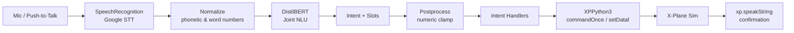

# Project Vimaan ✈️

> AI Co-Pilot for X-Plane — voice-controlled aviation assistant powered by joint intent recognition and slot filling.

[](https://github.com/hasnainrazaa03/Project-Vimaan/actions/workflows/ci.yml)
[]()
[]()
[]()
[]()

---

## Table of Contents

- [Overview](#overview)
- [How It Works](#how-it-works)
- [Repository Layout](#repository-layout)
- [Tech Stack](#tech-stack)
- [Supported Commands](#supported-commands)
- [Prerequisites](#prerequisites)
- [Installation](#installation)
- [Running the NLU Pipeline](#running-the-nlu-pipeline)
- [Running the X-Plane Plugin](#running-the-x-plane-plugin)
- [Evaluation](#evaluation)
- [Project Conventions](#project-conventions)
- [Roadmap & Known Issues](#roadmap--known-issues)
- [Contributing](#contributing)
- [Security](#security)
- [Credits](#credits)

---

## Overview

**Project Vimaan** is an experimental AI-driven First Officer for the [X-Plane](https://www.x-plane.com/) flight simulator. The pilot issues a natural-language voice command (e.g. *"climb to flight level two five zero"*), and the system:

1. Captures audio via push-to-talk (`Z` key).
2. Transcribes it to text using a speech recognizer.
3. Parses the text with a custom **joint intent + slot** NLU model (DistilBERT-based).
4. Maps the structured prediction to an X-Plane command/dataref via [XPPython3](https://xppython3.readthedocs.io/).
5. Speaks back a confirmation.

The project bundles three things in one repo:

- A **data pipeline** that synthesizes, paraphrases, cleans, and merges training data.
- An **NLU model** (joint intent classification + BIO slot tagging) and its training/eval/inference code.
- An **X-Plane plugin** that wires the model into the simulator.

---

## How It Works



### Pipeline stages

| Stage | Folder | What happens |
| --- | --- | --- |
| 1. Synthesis | `ML/data/generate_slot_dataset.py` | Schema-driven templated commands → `datasets/01_base/` |
| 2. Pegasus aug | `ML/data/generate_data_pegasus.py` | Paraphrase via `tuner007/pegasus_paraphrase` → `datasets/02_augmented_pegasus/` |
| 3. FLAN-T5 aug | `ML/data/generate_data_flan_t5.py` | Paraphrase via FLAN-T5 → `datasets/03_augmented_flan_t5/` |
| 4. Cleaning | `ML/data/clean_*.py` | Drop malformed, off-intent paraphrases → `datasets/04_clean_pegasus/`, `06_clean_flan_t5/` |
| 5. Merge | `ML/merge_datasets.py` | Dedup + shuffle + normalize → `datasets/05_final_merged/` |
| 6. Word-form aug | `ML/augment_with_word_forms.py` | Add "two" ↔ "2" variants |
| 7. Training | `ML/train_nlu_model.py` | Train joint DistilBERT model, save versioned → `models/vimaan_nlu_model_best/vN/` |
| 8. Inference | `ML/predict.py`, `ML/vimaan_nlu/inference.py` | Load latest model and predict |
| 9. Evaluation | `ML/evaluation/` | Metrics, confusion matrices, visualizations |
| 10. Plugin | `plugin/PI_VimaanCoPilot.py` | XPPython3 entry point |

---

## Repository Layout

```
ProjectVimaan/
├── README.md
├── CHANGELOG.md
├── CONTRIBUTING.md
├── FEATURES.md
├── requirements.txt
├── .gitignore
│
├── docs/
│   ├── ARCHITECTURE.md          ← system design & dataflow
│   ├── BUGS.md                  ← known bugs & footguns
│   ├── ROADMAP.md               ← planned features
│   ├── PROJECT_STRUCTURE.md     ← directory ownership map
│   ├── VERSION_CONTROL.md       ← git / remote workflow + quick command reference
│   └── PRODUCTION_CHECKLIST.md  ← pre-release checklist
│
├── plugin/
│   ├── PI_VimaanCoPilot.py      ← active X-Plane plugin (DistilBERT NLU)
│   └── legacy/
│       ├── AI_CoPilot.py        ← v1 plugin (joblib + MiniLM embeddings)
│       ├── PI_Vimaan_Whisper.py ← Whisper-based prototype
│       └── Plugin_Ref.py        ← reference snippets
│
├── ML/
│   ├── vimaan_nlu/               ← model, inference, normalization, postprocessing
│   ├── data/                    ← dataset generation / paraphrasing / cleaning
│   ├── evaluation/              ← evaluator, visualizer, batch runner
│   ├── utils/                   ← file/versioning helpers
│   ├── config/                  ← schema_config.py (intents, slots, synonyms)
│   ├── models/                  ← (gitignored) trained checkpoints
│   ├── datasets/                ← (gitignored) generated data
│   ├── predict.py               ← interactive CLI predictor
│   ├── train_nlu_model.py       ← training entry point
│   ├── merge_datasets.py
│   ├── augment_with_word_forms.py
│   └── command_tester.py        ← quick regression test of canned utterances
│
└── scratch/                     ← (gitignored) personal notes, never committed
```

See [docs/PROJECT_STRUCTURE.md](docs/PROJECT_STRUCTURE.md) for the full map.

---

## Tech Stack

**ML / NLU**
- [PyTorch](https://pytorch.org/), [Hugging Face Transformers](https://github.com/huggingface/transformers)
- **Base model:** `distilbert-base-uncased` with a joint head:
  - intent classifier (linear over `[CLS]`)
  - slot tagger (token-classification head, BIO tags)
- **Augmentation:** `tuner007/pegasus_paraphrase`, FLAN-T5
- **Numeric normalization:** `word2number`, `num2words`

**Plugin / Simulator**
- [X-Plane 12](https://www.x-plane.com/) + [XPPython3](https://xppython3.readthedocs.io/)
- `SpeechRecognition` (Google Web Speech API) — primary
- `openai-whisper` — alternative path (legacy plugin)
- `sounddevice`, `scipy`, `numpy` — audio capture & resampling

**Tooling**
- `tqdm`, `scikit-learn`, `matplotlib`

---

## Supported Commands

Current intent set covered by the model:

| Intent | Example utterances | Slots |
| --- | --- | --- |
| `set_autopilot_heading` | "set heading two seven zero", "fly heading 090" | `degrees` |
| `set_autopilot_altitude` | "climb to 15000 feet", "descend to seven thousand five hundred" | `altitude` |
| `set_flight_level` | "maintain flight level 210", "climb to FL350" | `flight_level` |
| `set_com_frequency` | "tune com 1 one one eight point seven five" | `com_port`, `frequency` |
| `toggle_landing_gear` | "gear up", "lower the landing gear" | `state` |
| `toggle_flaps` | "flaps down", "retract flaps" | `state` |
| `toggle_autopilot_1` / `_2` | "engage autopilot 1", "autopilot 2 off" | `state` |
| `toggle_flight_director_1` / `_2` | "flight director on" | `state` |
| `toggle_parking_brake` | "parking brake on", "release park brake" | `state` |
| `toggle_engine_1` / `_2` | "start engine 1", "shut down engine 2" | `state` |

Numeric guards (post-processor):
- Altitude clamped to **1 000–50 000 ft**
- Heading clamped to **0–360°**
- Flight level clamped to **10–430**
- COM frequency clamped to **118.000–137.000 MHz**

---

## Prerequisites

- **Python 3.11+** (3.13 also tested via cached bytecode)
- **macOS / Linux / Windows**
- For training: **CUDA-capable GPU** strongly recommended (CPU works but slow)
- For the plugin:
  - X-Plane 12
  - [XPPython3](https://xppython3.readthedocs.io/) installed in `X-Plane/Resources/plugins/`
  - PyAudio + a working microphone

---

## Installation

```bash
git clone https://github.com/hasnainrazaa03/Project-Vimaan.git
cd Project-Vimaan

python3 -m venv .venv
source .venv/bin/activate         # Windows: .venv\Scripts\activate

pip install --upgrade pip
pip install -r requirements.txt
```

> **Tip:** Keep local environment configuration outside version control.

---

## Running the NLU Pipeline

All commands assume you're in `ML/` and the venv is active.

```bash
cd ML

# 1. Generate base synthetic dataset
python data/generate_slot_dataset.py

# 2. Augment with Pegasus paraphrases (GPU recommended)
python data/generate_data_pegasus.py

# 3. Augment with FLAN-T5 paraphrases
python data/generate_data_flan_t5.py

# 4. Clean paraphrased datasets
python data/clean_pegasus_dataset.py
python data/clean_flan_t5_dataset.py

# 5. Merge into final training set
python merge_datasets.py

# 6. Word-form augmentation (optional)
python augment_with_word_forms.py

# 7. Train the joint NLU model
python train_nlu_model.py
# → saves to ML/models/vimaan_nlu_model_best/v<N>/

# 8. Interactive prediction
python predict.py

# 9. Run canned regression test
python command_tester.py
```

Versioning: every script appends `_vN` to outputs and the trainer writes the next available `vN/` model folder, so you never overwrite prior runs.

---

## Running the X-Plane Plugin

1. Build/train a model so that `ML/models/vimaan_nlu_model_best/vN/` exists.
2. Copy the **plugin folder + ML folder** into X-Plane:

   ```
   X-Plane 12/Resources/plugins/PythonPlugins/
   ├── PI_VimaanCoPilot.py        ← copy from plugin/
   └── ML/                        ← copy whole ML/ tree (with models/)
   ```

3. Start X-Plane. You should see `[Vimaan] Model loaded ...` in the Log.txt.
4. In the sim, **hold `Z`** to talk, release to execute.
5. Logs are written to `~/Vimaan_Logs/vimaan_plugin_<timestamp>.log`.

Default hotkey: `Z` (down → start recording, up → process).

---

## Evaluation

```bash
cd ML/evaluation
python run_single.py            # evaluate latest model on test split
python run_all.py               # evaluate every model version
python run_visualizations.py    # generate confusion matrix, per-intent F1, etc.
```

Outputs land in `ML/evaluation/results/` (gitignored): per-version JSON metrics + PNG visualizations.

---

## Project Conventions

- **Imports**: scripts that need to be runnable from `ML/` rely on `script_dir/...` and add `ML/` to `sys.path`. Do not break this without updating call sites.
- **File versioning**: never overwrite — use `get_next_version_path()` from `ML/utils/file_utils.py`.
- **Normalization**: any new training data must pass through `vimaan_nlu.normalization.normalize_dataset()` so phonetic numbers and decimals are unified.
- **Slot postprocessing**: numeric guards live in `vimaan_nlu/postprocessor.py`; extend there, not in the plugin.
- **Datasets & models are never committed.** See `.gitignore`.

---

## Roadmap & Known Issues

- 🐞 Bugs found while auditing the codebase: [docs/BUGS.md](docs/BUGS.md)
- 🚀 Planned features and improvements: [docs/ROADMAP.md](docs/ROADMAP.md)
- ✅ Production checklist: [docs/PRODUCTION_CHECKLIST.md](docs/PRODUCTION_CHECKLIST.md)
- 📜 Change history: [CHANGELOG.md](CHANGELOG.md)
- 🧭 Architecture deep dive: [docs/ARCHITECTURE.md](docs/ARCHITECTURE.md)

---

## Contributing

See [CONTRIBUTING.md](CONTRIBUTING.md) for branch strategy, commit conventions, and PR expectations.

**Source of truth**
- `origin` → `https://github.com/hasnainrazaa03/Project-Vimaan.git`

```bash
git checkout main
git pull --ff-only origin main
```

---

## Security

> ⚠️ **Never commit secrets.** If you discover a leaked secret in history, rotate it immediately and follow [GitHub's sensitive data removal guide](https://docs.github.com/en/authentication/keeping-your-account-and-data-secure/removing-sensitive-data-from-a-repository).

---

## Credits

Project Vimaan is developed and maintained by **Hasnain Raza**, **Aryan Shukla**, and **Vyom Shukla**.
