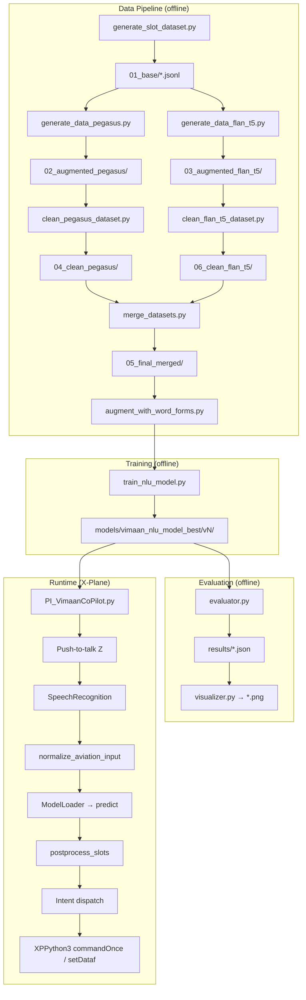

# Architecture

This document explains how Project Vimaan is wired end-to-end: data → model → plugin → simulator.

---

## 1. High-level



---

## 2. NLU model

### 2.1 Architecture

`JointIntentAndSlotModel` (see `ML/core/model.py`):

```
                    ┌──────────────────────────────┐
                    │   DistilBERT body (shared)   │
                    └──────────────┬───────────────┘
                                   │
                  ┌────────────────┴────────────────┐
                  │                                 │
        [CLS] hidden                       per-token hidden
                  │                                 │
         Dropout + Linear              Dropout + Linear (built-in)
                  │                                 │
         intent_logits (I)                 slot_logits (T × S)
```

- **Intent head:** linear layer on the `[CLS]` representation, predicts one of `I` intents.
- **Slot head:** the standard `DistilBertForTokenClassification` head, predicting one of `S` BIO tags per token.
- **Loss:** sum of cross-entropy on intent + cross-entropy on slots (`ignore_index=-100` for special tokens and sub-word continuations).

### 2.2 Tokenization & alignment

`train_nlu_model.py` uses `DistilBertTokenizerFast` with `is_split_into_words=True`. For each word's first sub-token we copy the BIO label; for subsequent sub-tokens we emit `-100` so they're ignored in loss/metrics.

### 2.3 Versioning

- `ML/utils/file_utils.get_next_version_path()` ensures every training run writes to `vN+1/` — no overwrites.
- `ModelLoader.load_all()` calls `get_latest_model_path()` to auto-pick the highest `vN/` directory.

### 2.4 Saved artifacts

Per version directory:
```
v9/
├── config.json
├── tokenizer_config.json, vocab.txt, special_tokens_map.json, tokenizer.json
├── pytorch_model.bin or model.safetensors    ← DistilBERT backbone
├── intent_classifier.bin                     ← our extra intent head
├── intent_map.json                           ← {intent: id, ...}
└── slot_map.json                             ← {BIO_tag: id, ...}
```

All of `models/` is `.gitignore`d.

---

## 3. Inference path

```python
text = "set heading two seven zero"

# 1) normalize phonetic + word numbers
normalized = normalize_aviation_input(text)
# → "set heading 270"

# 2) tokenize + forward
tokens = tokenizer(normalized, return_tensors="pt", is_split_into_words=True)
loss, intent_logits, slot_logits = model(**tokens)

# 3) extract
intent = intent_map_rev[intent_logits.argmax().item()]
slot_tags = [slot_map_rev[i] for i in slot_logits.argmax(-1)[0].tolist()]

# 4) postprocess (clamp altitudes, infer implicit on/off, etc.)
slots = postprocess_slots(intent, slots)

return {"intent": intent, "slots": slots, "confidence": softmax_max}
```

---

## 4. Plugin lifecycle

`plugin/PI_VimaanCoPilot.py` implements the XPPython3 plugin API:

| Callback | When | What we do |
| --- | --- | --- |
| `XPluginStart` | sim start | open log file, load model via `ModelLoader.load_all()`, find datarefs & commands, register hotkey `Z`. |
| `XPluginEnable` | every session | reset state |
| `OnPressCallback(Z, down)` | key down | start recording (`sr.Microphone()` context). |
| `OnPressCallback(Z, up)` | key up | stop recording, recognize, predict, dispatch intent, speak confirmation. |
| `XPluginDisable` | sim quit | release resources, close log. |
| `XPluginStop` | shutdown | final cleanup. |

Intent dispatch is a simple `if/elif` ladder mapping the predicted intent to either:
- `xp.commandOnce(cmd_ref)` — discrete actions (gear, flaps, engine start)
- `xp.setDataf(dref, value)` — numeric setpoints (heading bug, altitude bug, COM freq)

---

## 5. Data schema

Source of truth: `ML/config/schema_config.py`.

It defines:

- `INTENTS` — full list, with associated commands/datarefs and required slots.
- `SLOT_TYPES` — `altitude`, `heading`, `flight_level`, `frequency`, `com_port`, `state`, `engine_number`.
- `SYNONYMS` — surface variants the template generator expands.
- `SLOT_RANGES` — numeric bounds enforced by `postprocessor.py`.

Adding a new intent therefore touches:
1. `schema_config.py` (schema)
2. `data/generate_slot_dataset.py` (templates)
3. Re-run the whole pipeline → new model version
4. `plugin/PI_VimaanCoPilot.py` (dispatcher)

---

## 6. Path & import conventions

- `ML/` is structured to be importable as a package when its root is on `sys.path`.
- The plugin lives at `plugin/PI_VimaanCoPilot.py` and adds `<repo>/ML` to `sys.path` so `from core.model_loader import ModelLoader` works.
- Inside `ML/`, every script computes `script_dir = os.path.dirname(os.path.abspath(__file__))` and resolves data paths relative to it. **Do not change a script's location without updating these.**

Planned refactor (see [ROADMAP R-04](ROADMAP.md#-r-04--rename-core--vimaan_nlu)): rename `core` → `vimaan_nlu`, ship a proper package, drop the `sys.path` hack.

---

## 7. Failure modes & their guards

| Failure | Where caught | Recovery |
| --- | --- | --- |
| STT returns empty string | plugin | log + ignore |
| Confidence below threshold | (planned R-06) | "Say again?" prompt |
| Slot value out of range | `postprocessor.py` | clamp + log |
| Missing required slot | dispatcher | log "missing slot" + skip command |
| Dataref / command not found | `XPluginStart` | log error; skip mapping |
| Model directory missing | `ModelLoader.load_all` | raise `FileNotFoundError` early |
